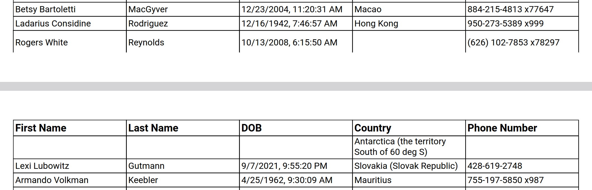

# @ag-media/react-pdf-table

`@ag-media/react-pdf-table` is a declarative table generator for [@react-pdf/renderer](https://github.com/diegomura/react-pdf).

> **Warning** <br />
> The library is specifically designed for use with **@react-pdf/renderer** and will
> **not work** with other react renderers.

[](https://npmjs.org/package/@ag-media/react-pdf-table "View this project on npm")

## Getting started

```bash
npm install --save-dev @ag-media/react-pdf-table
```

### Basic example

```jsx
import {Table, TR, TH, TD} from '@ag-media/react-pdf-table`;

const Component = () => (
    <Table>
        <TH>
            <TD>Header 1</TD>
            <TD>Header 2</TD>
        </TH>
        <TR>
            <TD>Data 1</TD>
            <TD>Data 2</TD>
        </TR>
    </Table>
);
```

Hint: you can use the short (`<TH />`, `<TR />`, `<TD />`) or
long (`<TableHeader />`, `<TableRow />`, `<TableCell />`) named imports.

Refer to the repo's [Storybook](https://ag-media.github.io/react-pdf-table) for more examples.

## Beware ⚠

While this library covers the usual table layouts, it's not a complete or
bullet-proof solution. Because not all layouts are 100% achievable with the
current react-pdf primitives, the table components need to be implemented in
react-pdf (**[upvote this issue](https://github.com/diegomura/react-pdf/issues/2015)**).

## Notes

### TableCell

Content in a TableCell must evaluate to a `string`, `number`, `<Fragment />`
or a `@react-pdf/renderer` component (`View`, `Text` etc.).

### Table's `tdProps` and `trProps`

These two props will be passed down to all TableCells and TableRows. Can be
used to style cells/rows ([styles example](https://github.com/ag-media/react-pdf-table/blob/master/stories/styles.stories.tsx)).

### `weighting`

Weightings can be defined once for all rows in Table's `weightings` prop
and for each TableCell individually. TableCell's `weighting` props has precedence
over the Table's `weightings`.

If `weighting` is not defined for a table cell then it will default to ocupy
an equal amount of the remaining space.

The sum of all `weighting`s for one line must should to 1, unless you want
a row to be smaller than the table.

## Limitations / Known issues

- page wrapping may happen in unexpected ways:
    
- flex layout is used to simulate how a table looks. Because of this, it's
    trivial to make columns not line up.
- border collapse

    Because there's no such thing in react-pdf, this has to be "emulated"
    with negative margins. This is especially painfull for non-default
    border styles (e.g. [outer border](https://github.com/ag-media/react-pdf-table/blob/master/stories/borderStyles/outer.stories.tsx))
- dashed and dotted table borders may meet irregularly or overlap
